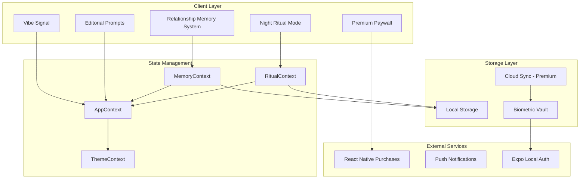

# Design Document: Premium Value Loop

## Overview

The Premium Value Loop creates a sophisticated ecosystem of interconnected features that build emotional lock-in through relationship memory preservation and intimate rituals. The system combines real-time emotional connection (Vibe Signal), anticipatory engagement (Editorial Prompts), relationship history building (Memory System), bedtime intimacy (Night Ritual Mode), and premium positioning focused on protecting emotional investment rather than accessing content.

The architecture prioritizes local storage for high emotional value at low operational cost, with premium features centered on memory preservation, export capabilities, and ritual customization. This approach creates a moat through emotional history rather than content access, making the app irreplaceable as couples build their shared story.

## Architecture

### Core System Components



### Data Flow Architecture

The system follows a hub-and-spoke pattern with AppContext as the central coordinator:

1. **Real-time Features** (Vibe Signal, Editorial Prompts) sync through AppContext
2. **Memory Features** use dedicated MemoryContext with local storage persistence
3. **Ritual Features** use RitualContext with scheduled notification integration
4. **Premium Features** gate access through subscription validation before feature execution

## Components and Interfaces

### Vibe Signal Component

```typescript
interface VibeSignalProps {
  currentVibe?: VibeColor;
  onVibeChange: (color: VibeColor) => void;
  partnerVibe?: VibeColor;
  isConnected: boolean;
}

interface VibeColor {
  id: string;
  name: string;
  primary: string;
  secondary: string;
  glow: string;
  isAnniversaryTheme?: boolean;
}

interface VibeSignalState {
  selectedVibe: VibeColor | null;
  partnerVibe: VibeColor | null;
  syncStatus: 'synced' | 'syncing' | 'offline';
  lastUpdated: Date;
}
```

### Relationship Memory System

```typescript
interface RelationshipMemory {
  id: string;
  type: 'first' | 'anniversary' | 'milestone' | 'inside_joke' | 'moment';
  title: string;
  description: string;
  date: Date;
  tags: string[];
  isShared: boolean;
  createdBy: 'user' | 'partner';
  createdAt: Date;
  photos?: string[]; // Premium feature
}

interface MemoryTimeline {
  memories: RelationshipMemory[];
  milestones: Milestone[];
  anniversaries: Anniversary[];
}

interface MemoryExport {
  format: 'pdf' | 'json';
  dateRange: { start: Date; end: Date };
  includePhotos: boolean; // Premium only
  template: 'elegant' | 'minimal' | 'romantic'; // Premium only
}
```

### Night Ritual Mode

```typescript
interface NightRitual {
  id: string;
  date: Date;
  prompt: string;
  checkIn: RitualResponse;
  appreciation: RitualResponse;
  dateIdea: RitualResponse;
  completedAt?: Date;
  partnerCompleted: boolean;
}

interface RitualResponse {
  question: string;
  userAnswer?: string;
  partnerAnswer?: string;
  isRevealed: boolean;
}

interface RitualFlow {
  id: string;
  name: string;
  isPremium: boolean;
  prompts: RitualPrompt[];
  schedule?: RitualSchedule; // Premium feature
}

interface RitualSchedule {
  enabled: boolean;
  time: string; // HH:MM format
  days: number[]; // 0-6, Sunday-Saturday
  reminderMinutes: number; // Premium feature
}
```

### Premium Paywall System

```typescript
interface PremiumFeature {
  id: string;
  name: string;
  description: string;
  category: 'memory' | 'ritual' | 'export' | 'sync';
  emotionalValue: string; // Focus on relationship protection
  icon: string;
}

interface SubscriptionTier {
  id: string;
  name: string;
  price: string;
  features: PremiumFeature[];
  emotionalBenefits: string[];
  memoryProtection: string[];
}
```

## Data Models

### Core Memory Model

```typescript
class MemoryManager {
  private memories: Map<string, RelationshipMemory> = new Map();
  private timeline: MemoryTimeline;
  
  async addMemory(memory: Omit<RelationshipMemory, 'id' | 'createdAt'>): Promise<void> {
    const newMemory: RelationshipMemory = {
      ...memory,
      id: generateId(),
      createdAt: new Date(),
    };
    
    this.memories.set(newMemory.id, newMemory);
    await this.persistToLocal();
    await this.syncWithPartner(newMemory);
    
    // Trigger anniversary theme if applicable
    if (this.isAnniversaryMemory(newMemory)) {
      await this.createAnniversaryVibeTheme(newMemory);
    }
  }
  
  async exportMemories(config: MemoryExport): Promise<string> {
    // Premium feature validation
    if (!await this.validatePremiumAccess()) {
      throw new Error('Premium subscription required for memory export');
    }
    
    return this.generateExport(config);
  }
  
  getTimelineForDateRange(start: Date, end: Date): RelationshipMemory[] {
    return Array.from(this.memories.values())
      .filter(memory => memory.date >= start && memory.date <= end)
      .sort((a, b) => a.date.getTime() - b.date.getTime());
  }
}
```

### Ritual State Management

```typescript
class RitualManager {
  private currentRitual: NightRitual | null = null;
  private ritualHistory: NightRitual[] = [];
  private customFlows: RitualFlow[] = []; // Premium feature
  
  async startNightRitual(): Promise<NightRitual> {
    const ritual: NightRitual = {
      id: generateId(),
      date: new Date(),
      prompt: await this.generatePrompt(),
      checkIn: await this.generateCheckIn(),
      appreciation: await this.generateAppreciation(),
      dateIdea: await this.generateDateIdea(),
      partnerCompleted: false,
    };
    
    this.currentRitual = ritual;
    await this.persistRitual(ritual);
    return ritual;
  }
  
  async completeRitual(responses: Partial<RitualResponse>[]): Promise<void> {
    if (!this.currentRitual) throw new Error('No active ritual');
    
    // Update responses
    this.currentRitual.completedAt = new Date();
    await this.syncWithPartner(this.currentRitual);
    
    // Provide gentle haptic feedback
    await HapticFeedback.impactAsync(HapticFeedback.ImpactFeedbackStyle.Light);
    
    // Add to history
    this.ritualHistory.push(this.currentRitual);
    this.currentRitual = null;
  }
}
```

### Premium Feature Gating

```typescript
class PremiumGatekeeper {
  private subscriptionStatus: SubscriptionStatus;
  
  async validateFeatureAccess(featureId: string): Promise<boolean> {
    const feature = PREMIUM_FEATURES.find(f => f.id === featureId);
    if (!feature) return true; // Free feature
    
    const hasSubscription = await this.checkSubscriptionStatus();
    if (!hasSubscription) {
      await this.showPremiumPaywall(feature);
      return false;
    }
    
    return true;
  }
  
  async showPremiumPaywall(feature: PremiumFeature): Promise<void> {
    // Focus on emotional value and memory protection
    const paywallContent = {
      title: "Protect Your Love Story",
      subtitle: "Premium features help preserve and enhance your relationship memories",
      feature: feature,
      emotionalBenefits: [
        "Export your complete relationship timeline",
        "Never lose your precious memories",
        "Create custom bedtime rituals",
        "Secure cloud backup of your story"
      ]
    };
    
    // Navigate to premium paywall with emotional framing
    NavigationService.navigate('PremiumPaywall', paywallContent);
  }
}
```

## Correctness Properties

*A property is a characteristic or behavior that should hold true across all valid executions of a system—essentially, a formal statement about what the system should do. Properties serve as the bridge between human-readable specifications and machine-verifiable correctness guarantees.*

Before defining the correctness properties, I need to analyze the acceptance criteria from the requirements to determine which are testable as properties.

### Property 1: Vibe Signal Synchronization
*For any* vibe color selection, the system should synchronize the color to the partner app within 2 seconds, display the correct glow effect, and use 400ms animation transitions
**Validates: Requirements 1.1, 1.2, 1.3, 6.1**

### Property 2: Memory Persistence and Timeline
*For any* relationship memory (firsts, anniversaries, milestones, inside jokes), the system should store it locally with timestamp and display it chronologically in the timeline
**Validates: Requirements 3.1, 3.2, 3.3, 3.4, 3.5**

### Property 3: Editorial Prompt Privacy Control
*For any* editorial prompt, partner answers should remain blurred until the current user submits their answer, then reveal with 400ms animation
**Validates: Requirements 2.2, 2.3, 2.5, 2.6**

### Property 4: Night Ritual Structure and Completion
*For any* night ritual activation, the system should present exactly 4 elements (prompt, check-in, appreciation, date idea), sync responses with partner, and provide haptic feedback on completion
**Validates: Requirements 4.2, 4.3, 4.8**

### Property 5: Premium Feature Gating
*For any* premium feature (memory export, custom rituals, scheduled reminders), access should be granted only to users with active subscriptions and denied to non-premium users
**Validates: Requirements 3.6, 3.7, 4.5, 4.6, 5.8**

### Property 6: Real-time Synchronization with Offline Handling
*For any* state change (vibe, memory, ritual response), the system should sync to partner app in real-time when connected, queue changes when offline, and handle concurrent updates gracefully
**Validates: Requirements 6.2, 6.3, 6.4, 6.5, 6.6, 6.7**

### Property 7: Design System Consistency
*For any* interface element, the system should use glassmorphism effects (10% opacity, 20px blur), Playfair Display typography for headers, and appropriate theme colors (standard or night mode)
**Validates: Requirements 1.4, 2.1, 4.1, 4.4, 5.1**

### Property 8: Haptic Feedback Consistency
*For any* user interaction (vibe selection, ritual completion, premium option interaction), the system should provide appropriate haptic feedback
**Validates: Requirements 1.5, 4.8, 5.7**

### Property 9: Memory-Vibe Integration
*For any* anniversary milestone in the memory system, the system should create corresponding anniversary-themed vibe color palettes
**Validates: Requirements 3.8**

### Property 10: Night Ritual Memory Integration
*For any* night ritual with relevant anniversaries or milestones, the system should surface those memories during the ritual
**Validates: Requirements 4.7**

## Error Handling

### Network Connectivity Errors
- **Offline State Management**: Queue all state changes locally when network is unavailable
- **Sync Conflict Resolution**: Use timestamp-based conflict resolution for concurrent updates
- **Graceful Degradation**: Continue core functionality without real-time sync when offline
- **User Feedback**: Provide subtle indicators for sync status without disrupting experience

### Premium Feature Access Errors
- **Subscription Validation**: Verify subscription status before premium feature access
- **Graceful Paywall Presentation**: Show premium paywall with emotional framing when access denied
- **Feature Degradation**: Provide basic functionality for non-premium users
- **Purchase Flow Integration**: Handle subscription purchase errors gracefully

### Memory Storage Errors
- **Local Storage Limits**: Implement storage cleanup for old memories if limits approached
- **Data Corruption**: Validate memory data integrity on load and provide recovery options
- **Export Failures**: Handle PDF generation errors with user-friendly messaging
- **Backup Validation**: Verify cloud sync integrity for premium users

### Animation and Performance Errors
- **Animation Fallbacks**: Provide instant transitions if 400ms animations fail
- **Performance Monitoring**: Detect and handle 60fps performance drops
- **Memory Leaks**: Implement proper cleanup for glassmorphism effects
- **Haptic Failures**: Continue normal operation if haptic feedback unavailable

## Testing Strategy

### Dual Testing Approach

The Premium Value Loop requires both unit testing and property-based testing for comprehensive coverage:

**Unit Tests** focus on:
- Specific examples of vibe color selections and partner synchronization
- Edge cases like network disconnection during sync
- Premium paywall presentation with different subscription states
- Memory export PDF generation with various data sets
- Night ritual completion flows with different response combinations
- Integration points between memory system and vibe themes

**Property Tests** focus on:
- Universal properties that hold for all inputs across the system
- Comprehensive input coverage through randomization
- Verification of correctness properties defined above
- Each property test runs minimum 100 iterations due to randomization

### Property-Based Testing Configuration

Using **fast-check** for TypeScript property-based testing:
- Minimum 100 iterations per property test
- Each test references its design document property
- Tag format: **Feature: premium-value-loop, Property {number}: {property_text}**

### Testing Implementation Requirements

**Memory System Testing**:
- Generate random memory types, dates, and content
- Test chronological ordering with various date ranges
- Verify local storage persistence across app restarts
- Test premium export functionality with subscription validation

**Synchronization Testing**:
- Test real-time sync with simulated network conditions
- Generate concurrent updates from both partners
- Verify offline queue and sync restoration
- Test conflict resolution with timestamp-based logic

**Premium Feature Testing**:
- Test feature gating with various subscription states
- Verify paywall presentation and purchase flow integration
- Test premium-only features like custom ritual flows
- Validate memory export and cloud sync functionality

**UI and Animation Testing**:
- Test glassmorphism effect consistency across components
- Verify 400ms animation timing with performance monitoring
- Test night mode theme application and color consistency
- Validate haptic feedback across different interaction types

The testing strategy ensures that the Premium Value Loop maintains its luxury experience while providing robust functionality across all user scenarios and subscription states.